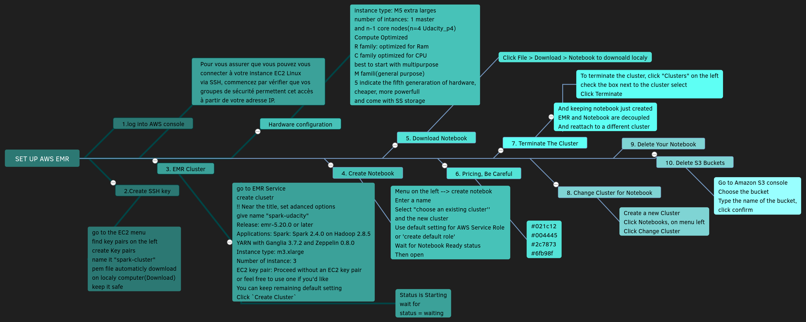
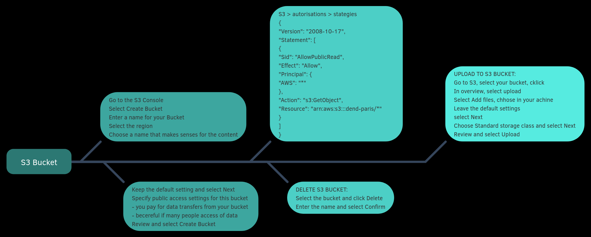
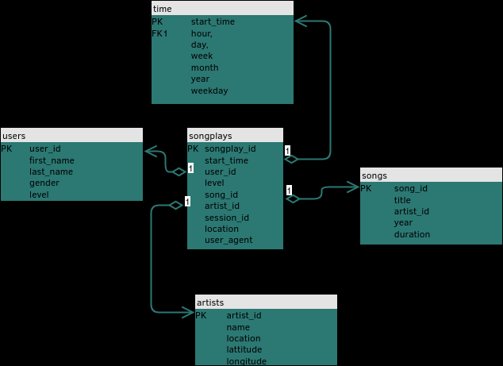
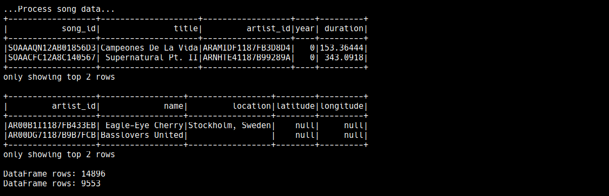
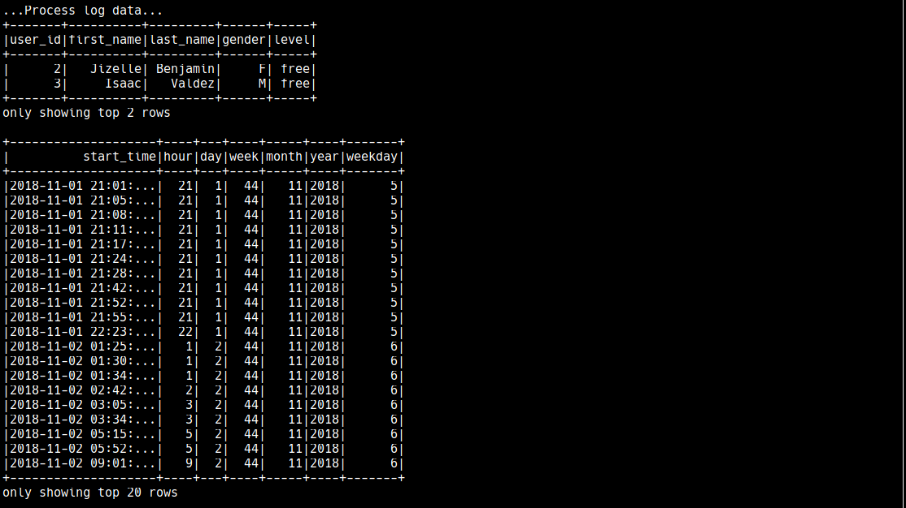
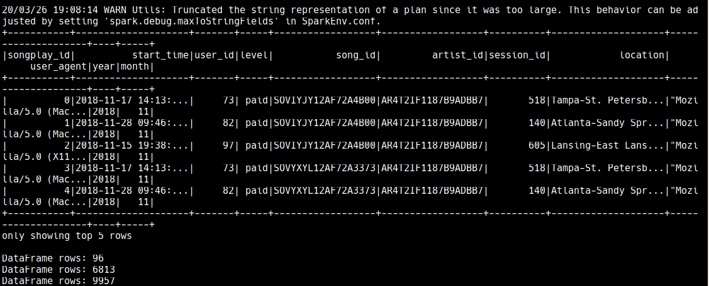
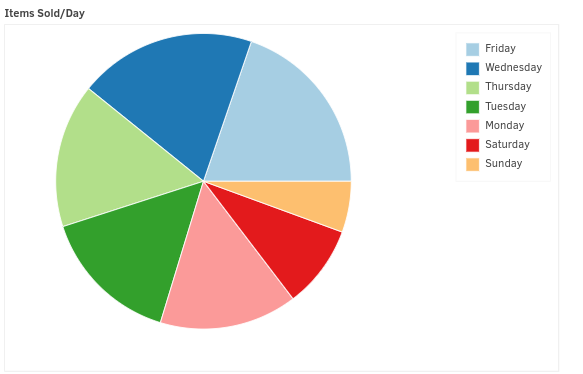
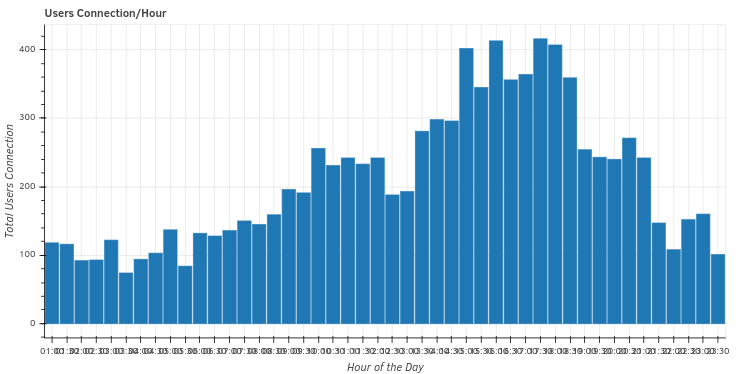
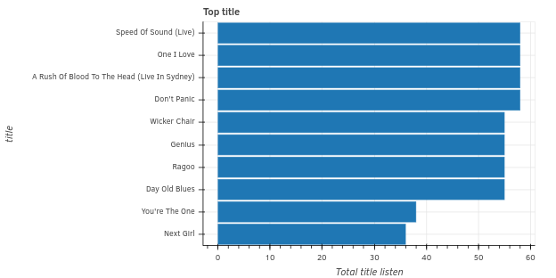

##### Udacity Data Engineering Nanodegree

  
</br>
</br>
</br>

# Project 4 : Data Lake

About an ETL pipeline for a data lake hosted on S3.

### Table of contents

   - [About The Project](#about-the-project)
   - [Purpose](#purpose)
   - [Getting Started](#getting-started)
        - [Dataset](#dataset)
   - [To Run Localy](#To-run-localy)
        - [Setup Docker](#Setup-Docker)
        - [Setup Your Credentials](#Setup-your-credentials)
        - [Run Scripts](#Run-scripts)    
   - [Worflow](#worflow)
        - [Define a Star Schema](#Define-a-Star-Schema)
        - [Sparkify Analytical](#Sparkify-Analytical)
   - [Web-links](#web-links)

## About The Project
---

A music streaming startup, Sparkify, has grown their user base and song database even more and want to move their data warehouse to a data lake. Their data resides in S3, in a directory of JSON logs on user activity on the app, as well as a directory with JSON metadata on the songs in their app.
They'd like a data engineer to build an ETL pipeline that extracts their data from Amazon S3, processes them using Spark, and loads the data into S3 as a set of dimmensionnal tables for their analytics team to continue finding insights in what songs their users are listening to.
 
## Purpose
---

The purpose of this project is to build an ETL pipeline for data stored in S3, using Spark and Hadoop tools.
* Load data from S3
* Process data using Spark into analytics tables
* Load the data results into S3

## Getting Started
---

### Dataset

The twice datasetset reside in S3:  

* `Song data: s3://udacity-dend/song_data`
* `Log data: s3://udacity-dend/log_data`

##### Song Dataset

The first dataset is a subset of real data from the Million Song Dataset. Each file is in JSON format and contains metadata about a song and the artist of that song. The files are partitioned by the first three letters of each song's track ID. 
```
song_data/A/B/C/TRABCEI128F424C983.json
song_data/A/A/B/TRAABJL12903CDCF1A.json
```
And below is an example of what a single song file, TRAABJL12903CDCF1A.json, looks like.
```
{"num_songs": 1, "artist_id": "ARJIE2Y1187B994AB7", "artist_latitude": null, "artist_longitude": null, "artist_location": "", "artist_name": "Line Renaud", "song_id": "SOUPIRU12A6D4FA1E1", "title": "Der Kleine Dompfaff", "duration": 152.92036, "year": 0}
```
##### Log Dataset

The second dataset consists of log files in JSON format generated by this event simulator based on the songs in the dataset above. These simulate app activity logs from an imaginary music streaming app based on configuration settings.
The log files in the dataset you'll be working with are partitioned by year and month. 
```
log_data/2018/11/2018-11-12-events.json
log_data/2018/11/2018-11-13-events.json
```
And below is an example of what the data in a log file, 2018-11-12-events.json, looks like.  


## To Run localy
---

### Setup Docker

You may have Docker in your machine.
I have [Systemd](https://www.digitalocean.com/community/tutorials/how-to-use-systemctl-to-manage-systemd-services-and-units) as system manager and use `systemctl start docker` for example. 
I choose to work with the swarm mode to learn about Docker machine. [Getting started with swarm mode](https://docs.docker.com/engine/swarm/swarm-tutorial/)

1. In a directory, clone this project from GitHub:
```sh
git clone https://github.com/anthelix/udacity_project4.git
```
2. In udacity_project4, create $PWD/data/postgres directory for PostgreSQL files:   
`cd udacity_project4`  
`mkdir -p ./data/postgres`
Edit: I would like practice postgres and Docker, I do that later and focus to the datalake. So it's optionnal.

3. Optional, for local development, install Python packages: (psycopg2-binary, bokeh)    
`pip3 install --upgrade pip --user`  
`python3 -m pip install -r worflow/config/requirements.txt`

4. Optional, pull docker images first, it's faster.    
`systemctl start docker`  
`docker pull jupyter/all-spark-notebook:latest`  
`docker pull postgres:12-alpine`  
`docker pull adminer:latest`

5. Init the swarm mode and the master node by default  
`docker swarm init` 

6. Deploy Docker Stack from the `udacity_project4` directory    
`docker stack deploy -c stack.yml jupyter`  
    And to check : `docker stack ps jupyter --no-trunc`  
Memo Commands:  
  deploy  : Deploy a new stack or update an existing stack  
  ls  : List stacks
  ps  : List the tasks in the stack  
  rm  : Remove one or more stacks  
  services  : List the services in the stack  

7. Retrieve the token to log into Jupyter.   
`docker logs $(docker ps | grep jupyter_spark | awk '{print $NF}')`.   
Crl + click in the terminal, on the link beginning as `http://127.0.0...`

8. From the Jupyter terminal, run the install script:   
`sh ./config/config_jupyter.sh`
Then go to the next section [Setup your credentials](#Setup-your-credentials)

9. To stop the services:  
`docker stack rm jupyter`

10. Then, to leave the docker swarn:  
`docker swarm leave --force`

12. To delete the images:
* `docker images`
* `docker rmi <IMAGE ID>`

### Setup your credentials
* Enter your credentials AWS in the `udacity_project4/workflow/dl.cfg` and keep them safe
    * please, don't write any quote and save.
    ```sql
    [AWS]
    KEY=XXXXXXX
    SECRET=XXXXXXXXX
    ```
### Run scripts 
* Go to the directory udacity_project4/worflow, open a terminal in Jupyter and run the the script to connect AWS S3, process datasets and write parquet file locally in worflow/ouput:  
`python3 01_etl.py`  
By default, datasets will be loaded from "udacity_project4/worflow/"

* Check the parquet file in **worflow/output** and make some queries with parquet files, open and run:  
`02_analyticals.ipynb`

* You may want use the jupyter notebook to run the **etl** process, open and run:  
`03_DataFromS3.ipynb`. An other script inside, **04_checkData.py**, check the data and the parquet files. 

* [Stop and delete Docker](#To-stop-the-docker)

* Delete the folder `udacity_project4`

#### To run in AWS EMR (ELASTIC MAP REDUCE)
* Create your own Amazon S3 Bucket and Amazon EMR cluster  
  



* Update the the input_data path and output_data path within `def main()` in  01_etl.py to point your s3 bucket  

* When the cluster is ready, ssh into the master node from the terminal
`ssh -i <~/path to your key .pem> hadoop@<your endpoint EMR>`

* Then transfer files to Hadoop and run `etl.py`

## Worflow
---
This project run with Docker. 
* ***./worflow/config/*** : configuration files
* ***./stack.yml*** : Dockerfile
* ***./worflow/01_etl.py*** : Script Python uses data in "s3://udacity-dend/", processes it, loads tables in database and stores then in parquet files in a bucket. In main(), we choose run localy or with AWS s3.
* ***/worflow/02_analyticals.ipynb*** : Jupyter Notebook checks the parquet file in the folder `output` (localy), processes queries and visualization with Bokeh uses the parquet files.
* ***/worflow/03_dataFromS3.ipynb*** : ETL Jupyter Notebook, and script to check tables and parquet files. 
* ***/worflow/04_checkData.py*** : Script Python to check tables and parquet files.
* ***/worflow/dl.cfg*** : Credentials file.
* ***/worflow/log_data/*** and ***/worflow/song_data/*** : Folders of raw data to process localy.
* ***/worflow/output/*** : Folder where the parquet files will be write if the ETl run localy, organized by tables. 
* ***/worflow/myouput/*** : Example, my folder `ouput` after running `01_etl.py`.
* ***/worflow/*** : Example, my `02_analyticals.ipynb` after running `01_etl.py`. 

In this project, we'll collecting input data to AWS S3, data will be loaded into AWS EMR for processing and the queries results will be stored back into AWS S3 as parquet files

### Define a Star Schema

* Schema for Song Play Analysis
    * Fact Table
        * songplays - records in log data associated with song plays i.e. records with page NextSong
            * songplay_id, start_time, user_id, level, song_id, artist_id, session_id, location, user_agent

* Dimension Tables
    * users - users in the app
        * user_id, first_name, last_name, gender, level
    * songs - songs in music database
        * song_id, title, artist_id, year, duration
    * artists - artists in music database
        * artist_id, name, location, lattitude, longitude
    * time - timestamps of records in songplays broken down into specific units
        * start_time, hour, day, week, month, year, weekday




### Collecting input data to AWS S3

```py
def create_song_data(spark, input_data):
    """
    process song data
    """
    try:
        # get filepath to song data file
        song_data = "song_data/*/*/*/*.json"
        input_song = input_data + song_data

        # read song data file
        song_schema = StructType([
            StructField("num_songs", IntegerType()),
            (...)
            StructField("year", IntegerType())
        ])    
        df_song = spark.read.json(input_song, schema = song_schema)
        df_song.printSchema()
        print('DataFrame schema: %s' % df_song)
        return df_song
    except Exception as e:
        print("Unexpected error: %s" % e)
```
### Process the data with spark 
```py
def process_song_data(df_song, output_data):
    """
    create songs_table and artists_table
    write tables to parquet files    
    """
    try:
        # extract columns to create songs table
        songs_table = df_song \
            .drop_duplicates(['song_id']) \
            .select("song_id", "title", "artist_id", "year", "duration") \
            .filter('song_id != "" and title != "" and artist_id != ""') \
            .sort("song_id")
        songs_table.show(2)

        # write songs table to parquet files partitioned by year and artist
        songs_table.collect()
        parquet_path = output_data + 'songs_table'
        write_parquet_song(songs_table, parquet_path)

        # extract columns to create artists table
        (...) 
        # write artists table to parquet files
        (...)

        return(songs_table, artists_table)
    except Exception as e:
        print("Unexpected error: %s" % e)
```




### Write results to parquet files
```py
def write_parquet_time(table, parquet_path):
    """
    write parquet files partionned in year and month
    """
    try:
        table.write.partitionBy(['year', 'month']).parquet(parquet_path, mode = 'overwrite')
    except Exception as e:
        print("Unexpected error: %s" % e)
```

### Sparkify Analytical

Business Questions about this Sparkify dataset:
* What are the busiest days of the week?
* What are the busiest times of the day?
* What are the top songs?

##### What are the busiest days of the week?
  
For this records, Friday and Wednesday are days of the weekf where there are the most different sessions.

##### What are the busiest times of the day?
  
Users log on the most between 15h30 and 18h30 in a week.

##### What are the top songs?
  
For the most listened to songs, the diagramm show that 8 songs are are the top.


## Web-links
---

* [memo dropDuplicates()](https://stackoverflow.com/questions/38687212/spark-dataframe-drop-duplicates-and-keep-first)  
* [StructType()](https://sparkbyexamples.com/spark/spark-sql-structtype-on-dataframe/)
* [Pyspark join](http://www.learnbymarketing.com/1100/pyspark-joins-by-example/)                                                                                                                                                                                                                                                                                                                                                                                                                                                                                                                                                                                                                                                                                                                                                                                                                                                                                                                                                                                                                                                                                                                                                                                                                                                                                                                                                                                                                                                                                                                                                                                                                                                                                                                                                                                                                                                                                                                                                                                                                                                                                                                                                                                                                                                                                                                                                                                                                                                                                                                                                                                                                                                                                                                                                                                                                                                                                                                                                                                                                                                                                                                                                                                                                                                                                                                                                                                                                                                                                                                                                                                                                                                                                                                                                                                                                                                                                                                                                                                                                                                                                                                                                                                                                                                                                                                                                                                                                                                                                                                                                                                                                                                                                                                                                                                                                                                                                                                                                                                                                                                                                                                                                                                                                                                                                                                                                                                                                                                                                                                                                                                                                                                                                                                                                                                                                                                                                                                                                                                                                                                                                                                                                                                                                                                                                                                                                                                                                                                                                                                                                                                                                                                                                                                                                                                                                                                                                                                                                                        